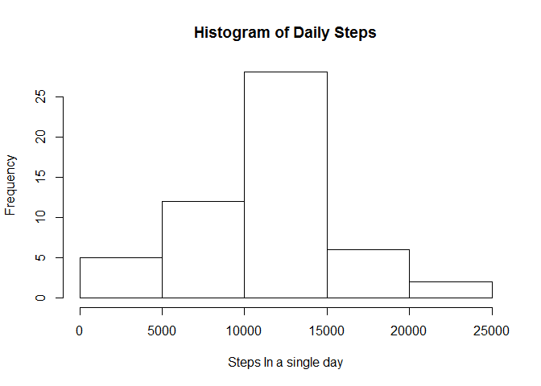
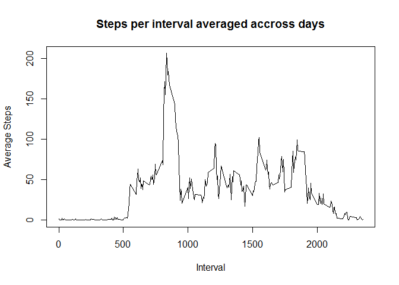
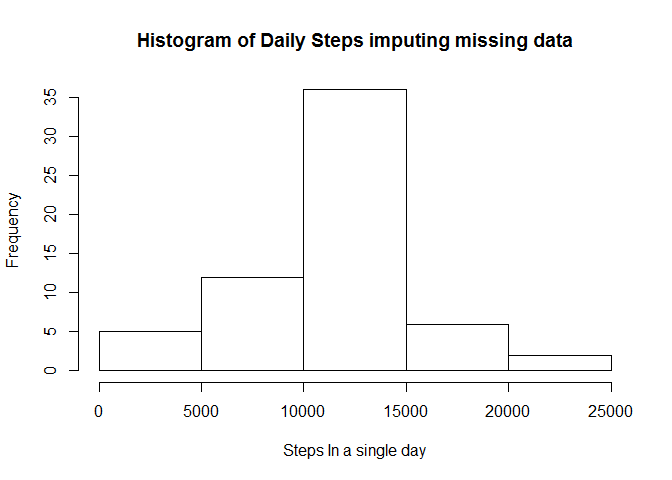
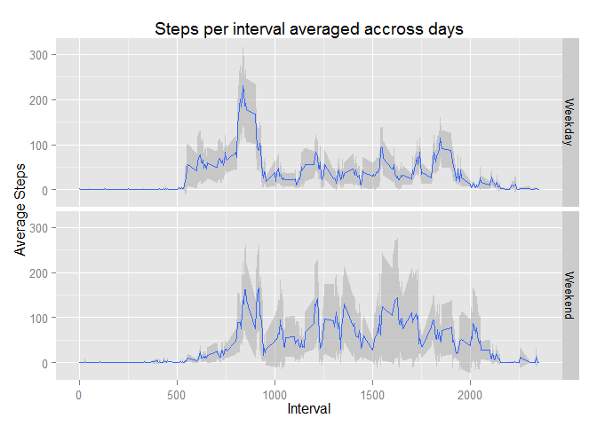

# Reproducible Research: Peer Assessment 1

The libraries required to undertake the analysis are

```r
#To Manipulate the data
library("plyr")

#For the multipanel chart
library("ggplot2")

#We also prefer to view figures without converting to scientific notation
options(scipen=999)
```

## Loading and preprocessing the data

###2 Steps to load and process the data file
1. Read the CSV file to a dataframe (using a relative path)

```r
activity <- read.csv(file = './activity.csv', stringsAsFactors = FALSE)
```
2. Convert the date field into a date type

```r
activity$date <- as.Date(activity$date)
```


## What is mean total number of steps taken per day?

Create Daily steps dataset

1. Summarize the data by day

```r
daily_activity <-
  aggregate(formula = steps~date, data = activity,FUN = sum, na.rm=TRUE)
```

2. Calculate summary statistics

```r
mean_steps <- round(mean(daily_activity$steps), 2)  # Mean
median_steps <- quantile(x = daily_activity$steps, probs = 0.5)  # Median, 50%Q
```
###Output Charts and Figures

1. Make a histogram of the total number of steps taken each day


```r
hist(daily_activity$steps,main="Histogram of Daily Steps",xlab="Steps In a single day")
```

 

2. Calculate and report the **mean** and **median** total number of steps taken per day 

    From the code above  
    the Mean Steps per day is **10766.19**  
    and  
    the Median steps per day is **10765**


## What is the average daily activity pattern?

Create interval summary dataset


```r
interval_activity <- aggregate(formula=steps~interval, data=activity, FUN=mean, na.rm=TRUE)
```

1. Find the interval with the highest average steps

```r
max_interval<-interval_activity[which(interval_activity$steps==max(interval_activity$steps)),]
max_intervalAvgSteps<-max(interval_activity$steps)
```

Interval with the highest Mean steps = **835**  
Maximum Mean steps = **206.1698**

2. Plot Average the Daily Pattern

```r
plot(interval_activity$interval,interval_activity$steps, type="n",main="Steps per interval averaged accross days",xlab="Interval",ylab="Average Steps")
lines(interval_activity$interval,interval_activity$steps)
```

 

## Imputing missing values

A large number of Values are missing from this dataset

```r
NAs <- sum(is.na(activity$steps))
```

**2304** values were found in the dataset

Tyhe intention is to impute these values using the average steps for the interval accross all days where the value was entered.

Firstly we calculate a rounded down number of steps for each of the average steps per interval to avoid entering decimal steps, we use the already calculated interval_activity variable to do this.


```r
interval_activity$rounded_steps <- floor(interval_activity$steps)
```

Next we created the imputed version of the data by merging the calculated values with the main activity dataset.


```r
imputed_activity <- merge(activity, interval_activity[,c('interval', 'rounded_steps')],by='interval')
```

Now we check if steps is NA and impute if it is.


```r
imputed_activity$imputed_steps <- ifelse(is.na(imputed_activity$steps),imputed_activity$rounded_steps,imputed_activity$steps)
```

Finally we check if the imputing of missing data has affected the outcomes of the initial activity by repeating earlier steps.

Create Daily steps dataset

1. Summarize the data by day

```r
daily_imputed_activity <- aggregate(formula = imputed_steps~date, data = imputed_activity,FUN = sum, na.rm=TRUE)
```

2. Calculate summary statistics

```r
imputed_mean_steps <- round(mean(daily_imputed_activity$imputed_steps), 2)  # Mean
imputed_median_steps <- quantile(x = daily_imputed_activity$imputed_steps, probs = 0.5)  # Median, 50%Q
```

###Output Charts and Figures

1. Make a histogram of the total number of steps taken each day (imputed)


```r
hist(daily_imputed_activity$imputed_steps,main="Histogram of Daily Steps imputing missing data",xlab="Steps In a single day")
```

 

2. Calculate and report the **mean** and **median** total number of steps taken per day (imputed)

    From the code above  
    the Mean Steps per day is now **10749.77** instead of **10766.19**   
    and  
    the Median steps per day is now **10641** instead of **10765**  
  
  

## Are there differences in activity patterns between weekdays and weekends?

Firstly create the new field to contain the day of week. As language variation could impact the use of the weekdays function we have opted to use the format function to achieve the same result.  
We are using the imputed dataset for this analysis.


```r
imputed_activity$weekday<- format(imputed_activity$date,"%u")
imputed_activity$weekday<- ifelse(imputed_activity$weekday>5,"Weekend","Weekday")
```

Now we create the function required to plot the data and call the plot to show the pattern for weekdays and weekends


```r
 mean_ci <- function(data){
     m <- mean(data)
     data.frame(y=m,
                ymin = m-(1.96*sd(data)/sqrt(length(data))),
                ymax = m+(1.96*sd(data)/sqrt(length(data))))
}

qplot(x=interval, y=imputed_steps, data=imputed_activity,geom="smooth", stat="summary", fun.data=mean_ci)+ labs(title="Steps per interval averaged accross days")+ labs(y="Average Steps")+labs( x="Interval")  + facet_grid(weekday~.)
```

 

At the weekend there is a smaller range (peak to trough) in the data however a more consistent level of steps taken through the day with a slightly later start and end to activity.
